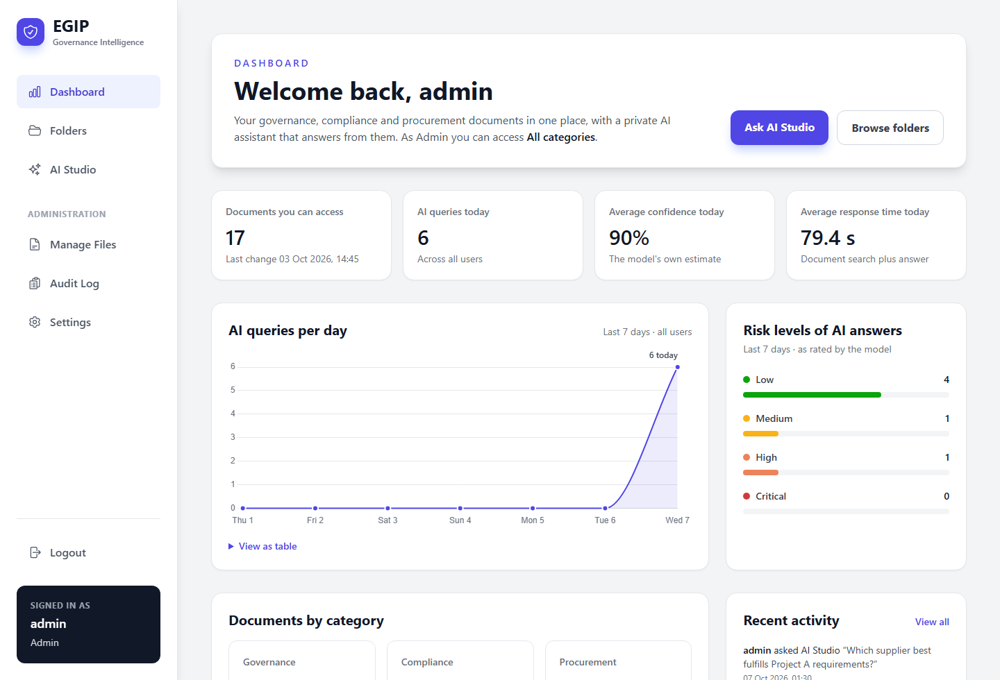
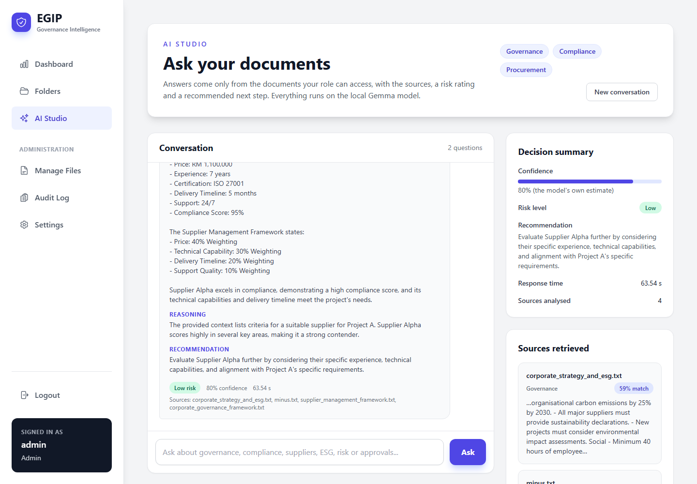
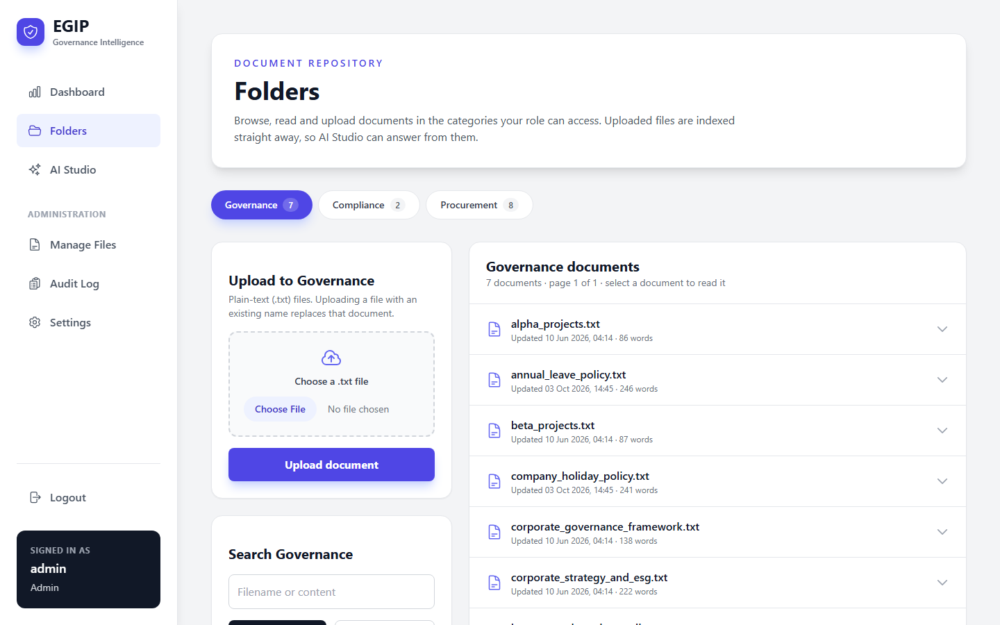
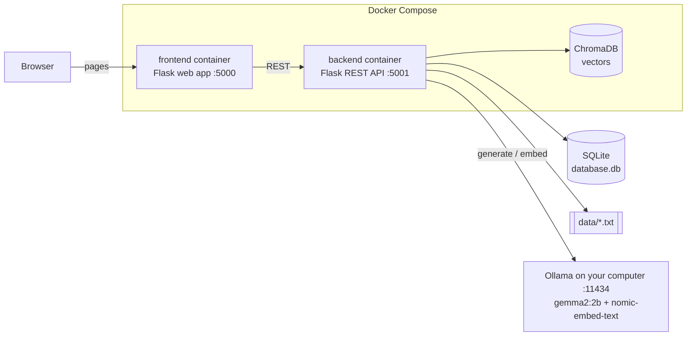

# EGIP — Enterprise Governance Intelligence Platform

> A private, local AI assistant for governance, compliance and procurement documents. Ask questions in plain English and get answers based on your organisation's own policies. Documents, database and AI model all stay on your machine.


-000000)



|  |  |
|:---:|:---:|
| **AI Studio:** answers with sources, a risk level and a confidence score | **Folders:** read, search and upload documents for your role |

## Contents

- [Overview](#overview)
- [Features](#features)
- [How it works](#how-it-works)
- [Tech stack](#tech-stack)
- [Project structure](#project-structure)
- [Getting started](#getting-started)
- [Configuration](#configuration)
- [Managing documents](#managing-documents)
- [API reference](#api-reference)
- [Troubleshooting](#troubleshooting)
- [Design decisions and trade-offs](#design-decisions-and-trade-offs)
- [Known limitations and security notes](#known-limitations-and-security-notes)
- [Roadmap](#roadmap)
- [Contributing](#contributing)
- [License](#license)

---

## Overview

### The problem

- **Fragmented information:** governance, compliance and procurement documents are scattered across departments.
- **Slow decisions:** finding the right policy or approval limit means hours of manual searching.
- **Inconsistent compliance:** without one source of truth, policies are applied unevenly.
- **No intelligent assistance:** staff cannot simply ask questions of their own policy documents.
- **Audit gaps:** who changed what, and when, is tracked by hand.

### Who it is for

| User | What they need |
|---|---|
| Board members and executives | Governance overview and decision support |
| Compliance officers | Policy management, risk visibility and an audit trail |
| Procurement teams | Supplier proposals, project requirements and vendor comparison |
| Legal department | Fast access to policies and frameworks |
| Internal auditors | A complete log of document changes and AI queries |

### What EGIP gives you

- One repository for governance, compliance and procurement documents
- An AI assistant that answers from your own documents and shows which ones it used
- Role-based access: each role only sees its own document categories
- An audit trail of uploads, edits, deletions and AI queries
- Fully local processing: no cloud AI service is called

---

## Features

### Web app (http://localhost:5000)

| Page | URL | Who | What it does |
|---|---|---|---|
| Login | `/login` | Everyone | Sign in with an account from `.env` |
| Dashboard | `/` | All roles | KPIs, a 7-day AI query trend, risk levels of recent AI answers and documents per category; refreshes itself every 15 seconds |
| Folders | `/folders` | All roles | One tab per category your role can access: read, search and upload `.txt` documents |
| AI Studio | `/chat` | All roles | Ask questions about your role's documents and get structured answers with sources; the conversation is saved until you start a new one |
| Manage Files | `/admin/files` | Admin | Upload, edit, move, delete, search and filter documents; create categories |
| Audit Log | `/admin/audit` | Admin | The latest 200 audit records |
| Settings | `/admin/settings` | Admin | Ollama and model status, search mode, knowledge base and re-indexing, accounts, recent activity |

### What each page shows

- **Dashboard:** documents you can access and when they last changed, AI queries today, average confidence and response time, a line chart of AI queries over the last 7 days (with a table view), and how many recent answers the model rated Low, Medium, High or Critical risk. Admins also see the latest activity.
- **Folders:** Governance, Compliance and Procurement tabs (plus any category an admin creates) with document counts. Select a document to read it; uploads are indexed for AI Studio straight away.
- **AI Studio:** each answer has key findings, reasoning, a risk level, a recommendation and a confidence score. The side panel shows a decision summary of the latest answer, the documents it was based on with how well each matched, and suggested questions for your role.
- **Settings:** whether Ollama is reachable, whether both models are pulled, whether search is semantic or keyword-based, how many documents are indexed, and the configured accounts (never their passwords).

### Roles and access

| Role | Default login | Document categories |
|---|---|---|
| `admin` | `admin` / `admin123` | Governance (`document`), compliance, procurement, plus the admin pages |
| `reporter` | `reporter` / `reporter123` | Compliance, procurement |
| `user` | `user` / `user123` | Governance (`document`) |

Change these passwords in `.env` before anyone else uses the app.

---

## How it works

### Architecture



- The browser only talks to the web app. The web app never touches the database; everything goes through the backend REST API.
- All counting and searching happens in the backend (SQL for the dashboard numbers, ChromaDB or keyword matching for AI search), so every page shows the same numbers.
- `database.db` and `data/` live in the project folder. The backend container mounts that folder, so the same files are used with and without Docker.

### How an AI answer is produced

1. **nomic-embed-text** turns the question into a vector, a list of numbers that captures its meaning.
2. **ChromaDB** returns the documents whose vectors are closest. A question can therefore match a relevant policy even when the two share few words. If the embedding model is unavailable, EGIP falls back to keyword matching.
3. The best-matching documents and the question are sent to **gemma2:2b**. It replies with key findings, reasoning, a risk level, a recommendation and a confidence score.
4. The answer is saved to your AI Studio conversation (the `ai_queries` table), written to the audit log and counted on the dashboard.

AI Studio only searches the categories your role can access. If no document matches, EGIP says so without asking the model. Starting a new conversation hides the old answers from AI Studio but keeps them in the dashboard statistics.

### AI models

| Model | Job | Download size |
|---|---|---|
| `gemma2:2b` | Writes the answers | ~1.6 GB |
| `nomic-embed-text` | Turns text into vectors for semantic search | ~274 MB |

### How fast is it?

Without a usable GPU, Ollama runs the model on the CPU, so expect **about 1 to 2 minutes per answer**. Measured on a laptop with a 4-core Intel Core i5 (10th gen) and `gemma2:2b`:

| Step | Time |
|---|---|
| Load the model (first question, or after 5 minutes without one) | ~12 s |
| Read the question and the matched documents (~1,750 tokens at ~25 tokens/s) | ~70 s |
| Write the structured answer (~200 tokens at ~4 tokens/s) | ~50 s |
| Search, database and web app | under 1 s |

Almost all of the time is the model itself. A GPU that can hold the whole model brings answers down to seconds; a 2 GB laptop GPU only fits part of it. Before a demo, ask one question so the model is already loaded, and keep the laptop plugged in. To stop Ollama unloading the model after 5 idle minutes, set `OLLAMA_KEEP_ALIVE=1h` in Ollama's environment and restart Ollama.

---

## Tech stack

| Layer | Technology |
|---|---|
| Web app | Flask, Jinja2 templates, Tailwind CSS (CDN), Chart.js (CDN) |
| Backend API | Flask |
| Database | SQLite |
| Vector search | ChromaDB 1.5 |
| AI | Ollama with gemma2:2b and nomic-embed-text |
| Deployment | Docker Compose (two containers) or uv for local runs |
| Python | 3.11 in the backend image; 3.14 in the frontend image and for local runs |

---

## Project structure

```text
GovernanceIntelligencePlatform/
├── backend/                   # REST API (port 5001)
│   ├── api.py                 # Flask routes
│   ├── database_logic.py      # SQLite, ChromaDB, Ollama calls, login, audit log
│   ├── requirements.txt       # dependencies for the Docker image
│   └── Dockerfile
├── frontend/                  # Web app (port 5000)
│   ├── app.py                 # Flask pages; calls the backend API
│   ├── templates/             # Jinja2 + Tailwind pages (dashboard, folders, chat, admin)
│   ├── requirements.txt
│   └── Dockerfile
├── data/                      # Source .txt documents, one folder per category
│   ├── compliance/
│   ├── document/              # governance documents
│   └── procurement/
├── docs/screenshots/          # images used in this README
├── database.db                # SQLite database with 17 sample documents
├── chroma_db/                 # vector store used by local runs
├── docker-compose.yml
├── main.py                    # local run: starts backend and web app together
├── Makefile                   # shortcuts: make up, make run, make health, ...
├── pyproject.toml, uv.lock    # dependencies for local runs
└── .env.example               # copy to .env
```

---

## Getting started

### Prerequisites

| Tool | Needed for |
|---|---|
| [Docker Desktop](https://www.docker.com/products/docker-desktop/) | Option A: run in containers (recommended) |
| Python 3.14 and [uv](https://docs.astral.sh/uv/) | Option B: run without Docker |
| [Ollama](https://ollama.com/download) | AI answers and semantic search (both options) |
| About 3 GB of free disk space and 8 GB+ of RAM | The two AI models |

### 1. Clone the repository

```bash
git clone https://github.com/HowardHoJiaHao/GovernanceIntelligencePlatform.git
cd GovernanceIntelligencePlatform
```

### 2. Create your `.env`

```bash
cp .env.example .env              # Windows PowerShell: Copy-Item .env.example .env
```

Open `.env` and change the passwords. Replace `SECRET_KEY` with a random value from `python -c "import secrets; print(secrets.token_hex(32))"`; `make env` does this for you. All variables are described in [Configuration](#configuration).

### 3. Install Ollama and pull the models

```bash
# Windows: winget install --id Ollama.Ollama -e   (or use the installer from ollama.com)
ollama pull gemma2:2b
ollama pull nomic-embed-text
curl http://localhost:11434/api/version     # prints the version when Ollama is running
```

On Windows and macOS the Ollama app starts the server automatically. On Linux, run `ollama serve`.

### 4a. Run with Docker (recommended)

```bash
docker compose up -d --build
```

This builds and starts two containers: `backend` (API, port 5001) and `frontend` (web app, port 5000). On first start, the backend embeds all documents in the background; follow along with `docker compose logs -f backend`.

```bash
docker compose ps                         # container status
docker compose logs -f backend            # backend logs
docker compose restart backend            # after editing backend code (mounted from ./backend)
docker compose up -d --build frontend     # after editing frontend code (copied into the image)
docker compose down                       # stop everything
```

### 4b. Run locally without Docker

```bash
uv sync           # creates .venv with Python 3.14 and all dependencies
uv run main.py    # starts the backend (5001) and the web app (5000); Ctrl+C stops both
```

Local runs use `database.db`, `data/` and `chroma_db/` in the project folder.

### 5. Sign in

Open **http://localhost:5000** and sign in with an account from `.env`. The default admin login is `admin` / `admin123`. Everyone sees **Dashboard**, **Folders** and **AI Studio**; admins also see **Manage Files**, **Audit Log** and **Settings**. Settings is the quickest way to check that Ollama and both models are ready.

Questions to try in AI Studio (it also suggests questions for your role):

- *What ISO certification does Supplier Alpha have?*
- *Which supplier best fulfills Project A requirements?*
- *Can a Project Manager approve RM75,000?*

Check that the backend is up with `curl http://localhost:5001/api/health`, which returns `{"status":"healthy"}`.

### Shortcuts with `make`

If you have GNU make (on Windows: `winget install ezwinports.make`), the [Makefile](Makefile) wraps the commands above:

| Command | What it does |
|---|---|
| `make` | List all targets |
| `make env` | Create `.env` from `.env.example` with a random `SECRET_KEY` (never overwrites an existing one) |
| `make models` | Pull `gemma2:2b` and `nomic-embed-text` |
| `make up` / `make down` | Start or stop the Docker containers (`up` builds images only if they are missing) |
| `make build` | Rebuild the images and restart, after changing frontend code or requirements |
| `make logs` / `make ps` | Follow logs or show container status |
| `make restart` | Restart the backend after editing backend code |
| `make install` / `make run` | Install dependencies and run locally without Docker |
| `make health` / `make reindex` | Check the API, or re-embed all documents |
| `make open` | Open the web app in your browser |
| `make check` | Compile-check the Python code and validate `docker-compose.yml` |

---

## Configuration

All settings live in `.env`; see [`.env.example`](.env.example).

| Variable | Default | Used by | Description |
|---|---|---|---|
| `ADMIN_USER` / `ADMIN_PASS` | `admin` / `admin123` | Backend | Admin account |
| `REPORTER_USER` / `REPORTER_PASS` | `reporter` / `reporter123` | Backend | Reporter account |
| `USER_USER` / `USER_PASS` | `user` / `user123` | Backend | Standard user account |
| `SECRET_KEY` | *(placeholder)* | Web app | Signs session cookies. Use a long random string; `make env` generates one. If it's missing or still the placeholder, the app uses a random key and logs everyone out on each restart. |
| `BACKEND_URL` | `http://127.0.0.1:5001` | Web app | Where the web app finds the API. Prefer `127.0.0.1` to `localhost`, which adds about 2 s to every request on Windows; `main.py` swaps it for you |
| `OLLAMA_HOST` | `http://127.0.0.1:11434` | Backend | Ollama server address (`127.0.0.1` for the same reason as `BACKEND_URL`) |
| `OLLAMA_MODEL` | `gemma2:2b` | Backend | Model that writes answers |
| `OLLAMA_EMBED_MODEL` | `nomic-embed-text` | Backend | Model used for semantic search |
| `DB_PATH` | empty, meaning `./database.db` | Backend | SQLite database file |
| `DATA_ROOT` | empty, meaning `./data` | Backend | Where uploaded `.txt` files are written |
| `CHROMA_PATH` | empty, meaning `./chroma_db` | Backend | Vector store folder |
| `BACKEND_PORT` / `FRONTEND_PORT` | `5001` / `5000` | Both | Optional port overrides |

`docker-compose.yml` sets `BACKEND_URL`, `OLLAMA_HOST`, `DB_PATH`, `DATA_ROOT` and `CHROMA_PATH` to container values, so one `.env` works for both Docker and local runs. In Docker, the vectors live in the `chroma_data` volume rather than `chroma_db/`.

---

## Managing documents

- **Categories are folders.** `data/document/` (governance), `data/compliance/` and `data/procurement/` match the `category` column in the database. Categories an admin creates in Manage Files are visible to admins only.
- **The app reads from `database.db`.** It ships with 17 sample documents. At startup the backend also imports any `.txt` file in `data/<category>/` that the database doesn't have yet, so you can drop files into a folder and restart.
- **Uploading** (through Folders or Manage Files) writes the file to `data/<category>/`, saves it in `database.db`, embeds it into ChromaDB and records it in the audit log. Only `.txt` files are supported, and a file with an existing name replaces that document.
- **Vector index:** at startup the backend embeds any document that has no vector yet and removes vectors whose document was deleted. To re-embed everything, use **Settings → Re-index all documents**, or:

  ```bash
  curl -X POST http://localhost:5001/api/reindex
  ```

- **Rebuilding from `data/`:** back up and delete `database.db`, then start the app. The backend creates the tables and imports every `.txt` file in `data/`.
- **Changing `OLLAMA_EMBED_MODEL`:** delete the vector store first, because vectors from different models can't be mixed. Delete `chroma_db/` for local runs, or run `docker compose down` and then `docker volume rm governanceintelligenceplatform_chroma_data` for Docker. Then start the app again.

---

## API reference

Base URL: `http://localhost:5001`. All bodies are JSON unless noted.

| Method | Path | Purpose |
|---|---|---|
| GET | `/api/health` | Liveness check |
| POST | `/api/login` | Check `{username, password}`; returns the user and role |
| GET | `/api/documents/<role>` | Documents a role may see |
| GET | `/api/document/<id>` | One document |
| POST | `/api/documents` | Create or update `{category, filename, content, actor, action}` (optional `previous_category`, `previous_filename` to move or rename) |
| POST | `/api/delete-document` | Delete `{document_id, username}` |
| GET | `/api/categories/<role>` | Categories a role may access |
| POST | `/api/categories` | Create a category folder `{name}` |
| GET | `/api/access-label/<role>` | Readable description of a role's access |
| POST | `/api/ai/query` | Structured answer `{question, role?, user?}`; with `role`, only that role's categories are searched. The answer is saved to `user`'s conversation |
| GET | `/api/ai/history?user=NAME` | That user's current AI Studio conversation |
| POST | `/api/ai/history/clear` | Start a new conversation `{user}` (answers stay in the statistics) |
| GET | `/api/dashboard/metrics?role=ROLE` | Document counts (for that role's categories, or all without `role`), AI usage today, 7-day trend and risk levels |
| GET | `/api/system/status` | Ollama reachability, model availability, indexed document count and storage paths |
| GET | `/api/accounts` | Configured accounts and roles (no passwords) |
| GET | `/api/audit/logs?limit=N` | Latest audit records |
| POST | `/api/bootstrap/run` | Create any missing database tables and import new files from `data/` |
| POST | `/api/reindex` | Re-embed every document into ChromaDB |

Example:

```bash
curl -X POST http://localhost:5001/api/ai/query \
  -H "Content-Type: application/json" \
  -d '{"question": "What ISO certification does Supplier Alpha have?"}'
```

On Windows PowerShell, type `curl.exe` instead of `curl`.

> ⚠️ The API has no authentication. Docker publishes it on `127.0.0.1` only; keep it that way unless you add authentication.

---

## Troubleshooting

| Symptom | Fix |
|---|---|
| `env file .env not found` from Docker | Create `.env` from `.env.example` (step 2). |
| Login page says *Backend service is unreachable* | Check `curl http://localhost:5001/api/health` and `docker compose logs backend`. For local runs, `BACKEND_URL` must be `http://127.0.0.1:5001`. |
| *Invalid username or password* | Accounts come from `.env`. After editing it, run `docker compose up -d --force-recreate`, or restart `main.py`. |
| AI says Ollama/Gemma is not available | Open **Settings**, or check `curl http://localhost:11434/api/version` and that `ollama list` shows `gemma2:2b`. On Windows, start the Ollama app. |
| Backend log: `model "nomic-embed-text" not found`, or Settings shows *Keyword fallback* | Run `ollama pull nomic-embed-text`, then **Settings → Re-index all documents**. Until then, AI search uses keyword matching. |
| Docker backend cannot reach Ollama | Docker Desktop (Windows/macOS) provides `host.docker.internal` automatically. On Linux, start Ollama with `OLLAMA_HOST=0.0.0.0 ollama serve` and keep port 11434 firewalled. |
| AI answers take 1 to 2 minutes | Normal without a GPU; see [How fast is it?](#how-fast-is-it). The first question also loads the model. Ask one question before a demo, or set `OLLAMA_KEEP_ALIVE=1h` for Ollama so the model stays loaded. |
| Ollama's log shows `device lost` or `Invalid device index`, or `nvidia-smi` says *GPU is lost* | The GPU crashed while running the model, and Ollama now falls back to the CPU. Restart the computer to recover the GPU and update its driver from the manufacturer. Small laptop GPUs (around 2 GB) only fit part of the model, so the CPU is often the more stable choice. Ollama's log is in `%LOCALAPPDATA%\Ollama\server.log` on Windows. |
| Port 5000 or 5001 already in use | Windows: `netstat -ano \| findstr :5001`, then `taskkill /PID <PID> /F`. macOS/Linux: `lsof -i :5001`. |
| `UnicodeEncodeError` when starting `backend/api.py` directly on Windows | Start with `uv run main.py`, or set `PYTHONUTF8=1` first. |
| Dashboard shows zeros and *backend is not responding* | The web app can't reach `BACKEND_URL`. Check `curl http://localhost:5001/api/health` and the backend logs. |

---

## Design decisions and trade-offs

**Decisions**

- **Separate web app and API.** The Flask web app renders pages and talks to the backend only over HTTP. Each runs in its own container, so either can change independently.
- **Local-first.** SQLite, ChromaDB and Ollama all run on your machine. No cloud AI services are used, documents stay in the organisation, and it works offline.
- **Semantic search with a fallback.** Vector search finds documents by meaning. If embeddings are unavailable, the backend falls back to keyword matching instead of failing.
- **Synchronous request/response.** There are no queues or workers apart from a background thread that indexes documents at startup, which makes the app easy to run and debug.
- **Accounts from environment variables.** Three role accounts live in `.env`. Setup stays trivial, but there is no self-service user management.

**Trade-offs**

| Choice | Benefit | Cost / upgrade path |
|---|---|---|
| SQLite | Zero setup, one file | Single node; move to PostgreSQL to scale |
| gemma2:2b via Ollama | Private, free, works offline | Slower and less accurate than large cloud models; change `OLLAMA_MODEL` |
| Plain-text documents | Simple, reliable ingestion | No PDF, DOCX or OCR support yet |
| Whole-document embeddings | Simple indexing | Long documents should be split into chunks |
| Flask development servers | Quick to run | Use a production WSGI server (e.g. gunicorn) for real deployments |

---

## Known limitations and security notes

- **No API authentication.** The backend accepts any request from anyone who can reach port 5001, who can then read or delete documents. It sends no CORS headers, so other websites open in your browser can't call it, and file and category names are sanitised so requests can't touch files outside `data/`. `docker-compose.yml` publishes ports 5000 and 5001 on `127.0.0.1` only. Add authentication before opening them to other machines.
- **Debug mode.** The web app runs Flask with `debug=True`, which turns on the interactive debugger. That's another reason to keep port 5000 on localhost.
- **Session key.** Anyone who knows `SECRET_KEY` can forge an admin login. Keep it secret and random, and never commit `.env`.
- **Plain-text passwords** are stored in `.env`. Change the defaults. `.env` is already in `.gitignore`.
- **Docker writes to the project folder.** Uploads and deletions in Docker change `database.db` and `data/` in your working copy.
- **Dates use the server's clock.** "Today" on the dashboard and the times on each page use the server's local time zone; Docker containers run in UTC unless you set one.
- **Risk levels are the model's own rating** of each answer, not a compliance score. Accounts are managed in `.env`, not in the app.
- **Small model, slow on a CPU.** `gemma2:2b` keeps everything local and light, but it can misread numbers (always check the cited sources) and takes 1 to 2 minutes per answer without a GPU. A larger model can be set with `OLLAMA_MODEL`.

---

## Roadmap

- [ ] Authentication on the backend API and a production WSGI server
- [ ] PDF and DOCX parsing, with document chunking
- [ ] Compliance scores and procurement KPIs on the dashboard
- [ ] User management stored in the database
- [ ] Integration with SAP, Oracle and Microsoft SharePoint
- [ ] AI-generated executive and compliance reports

---

## Contributing

1. Create a branch: `git checkout -b feature/my-change`
2. Run the app with `uv run main.py` or Docker, and check your change
3. Open a pull request that explains what changed and why

---

## License

No license file has been added yet, so all rights are reserved by the author. Add a `LICENSE` file (for example MIT) to allow others to reuse the code.

Built by [Howard Ho Jia Hao](https://github.com/HowardHoJiaHao).
