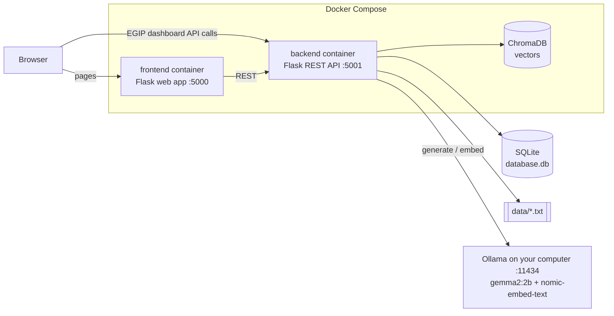

# EGIP — Enterprise Governance Intelligence Platform

> A private, local AI assistant for governance, compliance and procurement documents. Ask questions in plain English and get answers based on your organisation's own policies. Documents, database and AI model all stay on your machine.


-000000)

## Contents

- [Overview](#overview)
- [Features](#features)
- [How it works](#how-it-works)
- [Tech stack](#tech-stack)
- [Project structure](#project-structure)
- [Getting started](#getting-started)
- [Configuration](#configuration)
- [Managing documents](#managing-documents)
- [API reference](#api-reference)
- [Troubleshooting](#troubleshooting)
- [Design decisions and trade-offs](#design-decisions-and-trade-offs)
- [Known limitations and security notes](#known-limitations-and-security-notes)
- [Roadmap](#roadmap)
- [Contributing](#contributing)
- [License](#license)

---

## Overview

### The problem

- **Fragmented information:** governance, compliance and procurement documents are scattered across departments.
- **Slow decisions:** finding the right policy or approval limit means hours of manual searching.
- **Inconsistent compliance:** without one source of truth, policies are applied unevenly.
- **No intelligent assistance:** staff cannot simply ask questions of their own policy documents.
- **Audit gaps:** who changed what, and when, is tracked by hand.

### Who it is for

| User | What they need |
|---|---|
| Board members and executives | Governance overview and decision support |
| Compliance officers | Policy management, risk visibility and an audit trail |
| Procurement teams | Supplier proposals, project requirements and vendor comparison |
| Legal department | Fast access to policies and frameworks |
| Internal auditors | A complete log of document changes and AI queries |

### What EGIP gives you

- One repository for governance, compliance and procurement documents
- An AI assistant that answers from your own documents and shows which ones it used
- Role-based access: each role only sees its own document categories
- An audit trail of uploads, edits, deletions and AI queries
- Fully local processing: no cloud AI service is called

---

## Features

### Web app (http://localhost:5000)

| Page | URL | Who | What it does |
|---|---|---|---|
| Login | `/login` | Everyone | Sign in with an account from `.env` |
| Document Repository | `/` | All roles | Document counts for the categories your role can access |
| AI Chatbot | `/chat` | All roles | Ask a question and get the same structured answer as AI Studio, searched only within your role's categories, with the matched documents and excerpts |
| Upload | `/upload` | All roles | Upload a `.txt` file into one of your categories (not linked in the sidebar) |
| EGIP Dashboard | `/egip` | Admin | Executive dashboard: KPIs, document folders and AI Studio (see below) |
| Manage Files | `/admin/files` | Admin | Upload, edit, delete, search and filter documents |
| Audit Log | `/admin/audit` | Admin | The latest 200 audit records |

### EGIP Dashboard (`/egip`)

- **Home:** documents per folder, AI queries today, average confidence and response time, and a 7-day AI query trend
- **Folder:** Governance, Compliance and Procurement tabs with live document lists and `.txt` upload
- **AI Studio:** semantic search plus a structured answer (key findings, reasoning, risk level, recommendation, confidence score) with the source documents and their relevance
- **Settings:** recent audit records from the server and the total document count

> The risk distribution, compliance score and procurement overview cards have no data source yet and show 0. User management on the Settings page is a mock-up and isn't saved.

### Roles and access

| Role | Default login | Document categories |
|---|---|---|
| `admin` | `admin` / `admin123` | Governance (`document`), compliance, procurement, plus the admin pages |
| `reporter` | `reporter` / `reporter123` | Compliance, procurement |
| `user` | `user` / `user123` | Governance (`document`) |

Change these passwords in `.env` before anyone else uses the app.

---

## How it works

### Architecture



- The web app never touches the database. Everything goes through the backend REST API.
- The EGIP dashboard runs in the browser and calls the backend directly on port 5001.
- `database.db` and `data/` live in the project folder. The backend container mounts that folder, so the same files are used with and without Docker.

### How an AI answer is produced

1. **nomic-embed-text** turns the question into a vector, a list of numbers that captures its meaning.
2. **ChromaDB** returns the documents whose vectors are closest. A question can therefore match a relevant policy even when the two share few words. If the embedding model is unavailable, EGIP falls back to keyword matching.
3. The best-matching documents and the question are sent to **gemma2:2b**. It replies with key findings, reasoning, a risk level, a recommendation and a confidence score.
4. The query is written to the audit log and counted on the dashboard.

The AI Chatbot page (`/chat`) and EGIP AI Studio use this same pipeline. The chatbot only searches the categories your role can access; AI Studio is admin-only and searches every category. If no document matches, EGIP says so without asking the model.

### AI models

| Model | Job | Download size |
|---|---|---|
| `gemma2:2b` | Writes the answers | ~1.6 GB |
| `nomic-embed-text` | Turns text into vectors for semantic search | ~274 MB |

---

## Tech stack

| Layer | Technology |
|---|---|
| Web app | Flask, Jinja2 templates, Tailwind CSS (CDN) |
| EGIP dashboard | HTML, Bootstrap 5, Chart.js |
| Backend API | Flask, flask-cors |
| Database | SQLite |
| Vector search | ChromaDB 1.5 |
| AI | Ollama with gemma2:2b and nomic-embed-text |
| Deployment | Docker Compose (two containers) or uv for local runs |
| Python | 3.11 in the backend image; 3.14 in the frontend image and for local runs |

---

## Project structure

```text
GovernanceIntelligencePlatform/
├── backend/                   # REST API (port 5001)
│   ├── api.py                 # Flask routes
│   ├── database_logic.py      # SQLite, ChromaDB, Ollama calls, login, audit log
│   ├── requirements.txt       # dependencies for the Docker image
│   └── Dockerfile
├── frontend/                  # Web app (port 5000)
│   ├── app.py                 # Flask pages; calls the backend API
│   ├── egip.html              # EGIP dashboard, served at /egip
│   ├── templates/             # Jinja2 + Tailwind pages
│   ├── requirements.txt
│   └── Dockerfile
├── data/                      # Source .txt documents, one folder per category
│   ├── compliance/
│   ├── document/              # governance documents
│   └── procurement/
├── scripts/
│   ├── ingest.py              # load data/ into SQLite and ChromaDB
│   └── synthetic_data.py      # generate demo files (deletes database.db!)
├── database.db                # SQLite database with 14 sample documents
├── chroma_db/                 # vector store used by local runs
├── check_count.py, countchromadb.py, test.py   # quick ChromaDB inspection scripts
├── docker-compose.yml
├── main.py                    # local run: starts backend and web app together
├── Makefile                   # shortcuts: make up, make run, make health, ...
├── pyproject.toml, uv.lock    # dependencies for local runs
└── .env.example               # copy to .env
```

---

## Getting started

### Prerequisites

| Tool | Needed for |
|---|---|
| [Docker Desktop](https://www.docker.com/products/docker-desktop/) | Option A: run in containers (recommended) |
| Python 3.14 and [uv](https://docs.astral.sh/uv/) | Option B: run without Docker |
| [Ollama](https://ollama.com/download) | AI answers and semantic search (both options) |
| About 3 GB of free disk space and 8 GB+ of RAM | The two AI models |

### 1. Clone the repository

```bash
git clone https://github.com/HowardHoJiaHao/GovernanceIntelligencePlatform.git
cd GovernanceIntelligencePlatform
```

### 2. Create your `.env`

```bash
cp .env.example .env              # Windows PowerShell: Copy-Item .env.example .env
```

Open `.env` and change the passwords. Replace `SECRET_KEY` with a random value from `python -c "import secrets; print(secrets.token_hex(32))"`; `make env` does this for you. All variables are described in [Configuration](#configuration).

### 3. Install Ollama and pull the models

```bash
# Windows: winget install --id Ollama.Ollama -e   (or use the installer from ollama.com)
ollama pull gemma2:2b
ollama pull nomic-embed-text
curl http://localhost:11434/api/version     # prints the version when Ollama is running
```

On Windows and macOS the Ollama app starts the server automatically. On Linux, run `ollama serve`.

### 4a. Run with Docker (recommended)

```bash
docker compose up -d --build
```

This builds and starts two containers: `backend` (API, port 5001) and `frontend` (web app, port 5000). On first start, the backend embeds all documents in the background; follow along with `docker compose logs -f backend`.

```bash
docker compose ps                         # container status
docker compose logs -f backend            # backend logs
docker compose restart backend            # after editing backend code (mounted from ./backend)
docker compose up -d --build frontend     # after editing frontend code (copied into the image)
docker compose down                       # stop everything
```

### 4b. Run locally without Docker

```bash
uv sync           # creates .venv with Python 3.14 and all dependencies
uv run main.py    # starts the backend (5001) and the web app (5000); Ctrl+C stops both
```

Local runs use `database.db`, `data/` and `chroma_db/` in the project folder.

### 5. Sign in

Open **http://localhost:5000** and sign in with an account from `.env`. The default admin login is `admin` / `admin123`. Admins see **EGIP Dashboard**, **Manage Files** and **Audit Log** in the sidebar.

Questions to try in AI Studio or the AI Chatbot:

- *What ISO certification does Supplier Alpha have?*
- *Which supplier best fulfills Project A requirements?*
- *What are the ESG targets for 2026?*

Check that the backend is up with `curl http://localhost:5001/api/health`, which returns `{"status":"healthy"}`.

### Shortcuts with `make`

If you have GNU make (on Windows: `winget install ezwinports.make`), the [Makefile](Makefile) wraps the commands above:

| Command | What it does |
|---|---|
| `make` | List all targets |
| `make env` | Create `.env` from `.env.example` with a random `SECRET_KEY` (never overwrites an existing one) |
| `make models` | Pull `gemma2:2b` and `nomic-embed-text` |
| `make up` / `make down` | Start or stop the Docker containers (`up` builds images only if they are missing) |
| `make build` | Rebuild the images and restart, after changing frontend code or requirements |
| `make logs` / `make ps` | Follow logs or show container status |
| `make restart` | Restart the backend after editing backend code |
| `make install` / `make run` | Install dependencies and run locally without Docker |
| `make health` / `make reindex` | Check the API, or re-embed all documents |
| `make open` | Open the web app in your browser |
| `make check` | Compile-check the Python code and validate `docker-compose.yml` |

---

## Configuration

All settings live in `.env`; see [`.env.example`](.env.example).

| Variable | Default | Used by | Description |
|---|---|---|---|
| `ADMIN_USER` / `ADMIN_PASS` | `admin` / `admin123` | Backend | Admin account |
| `REPORTER_USER` / `REPORTER_PASS` | `reporter` / `reporter123` | Backend | Reporter account |
| `USER_USER` / `USER_PASS` | `user` / `user123` | Backend | Standard user account |
| `SECRET_KEY` | *(placeholder)* | Web app | Signs session cookies. Use a long random string; `make env` generates one. If it's missing or still the placeholder, the app uses a random key and logs everyone out on each restart. |
| `BACKEND_URL` | `http://localhost:5001` | Web app | Where the web app finds the API |
| `OLLAMA_HOST` | `http://localhost:11434` | Backend | Ollama server address |
| `OLLAMA_MODEL` | `gemma2:2b` | Backend | Model that writes answers |
| `OLLAMA_EMBED_MODEL` | `nomic-embed-text` | Backend | Model used for semantic search |
| `DB_PATH` | empty, meaning `./database.db` | Backend | SQLite database file |
| `DATA_ROOT` | empty, meaning `./data` | Backend | Where uploaded `.txt` files are written |
| `CHROMA_PATH` | empty, meaning `./chroma_db` | Backend | Vector store folder |
| `BACKEND_PORT` / `FRONTEND_PORT` | `5001` / `5000` | Both | Optional port overrides |

`docker-compose.yml` sets `BACKEND_URL`, `OLLAMA_HOST`, `DB_PATH`, `DATA_ROOT` and `CHROMA_PATH` to container values, so one `.env` works for both Docker and local runs. In Docker, the vectors live in the `chroma_data` volume rather than `chroma_db/`.

---

## Managing documents

- **Categories are folders.** `data/document/` (governance), `data/compliance/` and `data/procurement/` match the `category` column in the database.
- **The app reads from `database.db`.** It ships with 14 sample documents. Files in `data/` are a copy of each document and are not re-read automatically.
- **Uploading** (through Manage Files, `/upload` or the EGIP folder tabs) writes the file to `data/<category>/`, saves it in `database.db`, embeds it into ChromaDB and records it in the audit log. Only `.txt` files are supported.
- **Vector index:** at startup the backend embeds any document that has no vector yet. To re-embed everything:

  ```bash
  curl -X POST http://localhost:5001/api/reindex
  ```

- **Rebuilding from `data/`:** back up and delete `database.db`, then run `uv run scripts/ingest.py` from the project root with Ollama running. If the database already has documents, the script adds duplicates.
- **Changing `OLLAMA_EMBED_MODEL`:** delete the vector store first, because vectors from different models can't be mixed. Delete `chroma_db/` for local runs, or run `docker compose down` and then `docker volume rm governanceintelligenceplatform_chroma_data` for Docker. Then start the app again.

---

## API reference

Base URL: `http://localhost:5001`. All bodies are JSON unless noted.

| Method | Path | Purpose |
|---|---|---|
| GET | `/api/health` | Liveness check |
| POST | `/api/login` | Check `{username, password}`; returns the user and role |
| GET | `/api/documents` | All documents (used by the EGIP dashboard) |
| GET | `/api/documents/<role>` | Documents a role may see |
| GET | `/api/document/<id>` | One document |
| POST | `/api/documents` | Create or update `{category, filename, content, actor, action}` |
| POST | `/api/documents/upload` | Upload a `.txt` (multipart: `file`, `category`; `governance` is stored as `document`) |
| POST | `/api/delete-document` | Delete `{document_id, username}` |
| GET | `/api/categories/<role>` | Categories a role may access |
| POST | `/api/categories` | Create a category folder `{name}` |
| GET | `/api/access-label/<role>` | Readable description of a role's access |
| POST | `/api/generate` | Send a raw `{prompt}` to the chat model |
| POST | `/api/RAG` | Retrieve context and answer `{prompt}`; returns `{model_answer}` |
| POST | `/api/ai/query` | Structured answer for AI Studio and the AI Chatbot `{question, role?, user?, module?}`; with `role`, only that role's categories are searched |
| GET | `/api/dashboard/metrics` | Document counts and AI usage for the EGIP home page |
| GET | `/api/audit/logs?limit=N` | Latest audit records (alias: `/api/audit-logs`) |
| POST | `/api/audit/log` | Add an audit record `{user, action, module, details}` |
| POST | `/api/bootstrap/run` | Create any missing database tables |
| POST | `/api/reindex` | Re-embed every document into ChromaDB |

Example:

```bash
curl -X POST http://localhost:5001/api/ai/query \
  -H "Content-Type: application/json" \
  -d '{"question": "What ISO certification does Supplier Alpha have?"}'
```

On Windows PowerShell, type `curl.exe` instead of `curl`.

> ⚠️ The API has no authentication. Docker publishes it on `127.0.0.1` only; keep it that way unless you add authentication.

---

## Troubleshooting

| Symptom | Fix |
|---|---|
| `env file .env not found` from Docker | Create `.env` from `.env.example` (step 2). |
| Login page says *Backend service is unreachable* | Check `curl http://localhost:5001/api/health` and `docker compose logs backend`. For local runs, `BACKEND_URL` must be `http://localhost:5001`. |
| *Invalid username or password* | Accounts come from `.env`. After editing it, run `docker compose up -d --force-recreate`, or restart `main.py`. |
| AI says Ollama/Gemma is not available | Check `curl http://localhost:11434/api/version` and that `ollama list` shows `gemma2:2b`. On Windows, start the Ollama app. |
| Backend log: `model "nomic-embed-text" not found` | Run `ollama pull nomic-embed-text`, then `curl -X POST http://localhost:5001/api/reindex`. Until then, AI search uses keyword matching. |
| Docker backend cannot reach Ollama | Docker Desktop (Windows/macOS) provides `host.docker.internal` automatically. On Linux, start Ollama with `OLLAMA_HOST=0.0.0.0 ollama serve` and keep port 11434 firewalled. |
| First AI answer is slow | The model loads into memory on the first request. On CPU-only machines this can take about a minute. |
| Port 5000 or 5001 already in use | Windows: `netstat -ano \| findstr :5001`, then `taskkill /PID <PID> /F`. macOS/Linux: `lsof -i :5001`. |
| `UnicodeEncodeError` when starting `backend/api.py` directly on Windows | Start with `uv run main.py`, or set `PYTHONUTF8=1` first. |
| EGIP dashboard shows zeros or *Unable to process request* | The page calls `http://<host>:5001/api` from your browser. Make sure the backend is reachable on that port. |
| AI cites the same document twice (local runs) | The committed `chroma_db/` contains old duplicate vectors. Delete `chroma_db/` and restart; the backend re-embeds everything at startup. |

---

## Design decisions and trade-offs

**Decisions**

- **Separate web app and API.** The Flask web app renders pages and talks to the backend only over HTTP. Each runs in its own container, so either can change independently.
- **Local-first.** SQLite, ChromaDB and Ollama all run on your machine. No cloud AI services are used, documents stay in the organisation, and it works offline.
- **Semantic search with a fallback.** Vector search finds documents by meaning. If embeddings are unavailable, the backend falls back to keyword matching instead of failing.
- **Synchronous request/response.** There are no queues or workers apart from a background thread that indexes documents at startup, which makes the app easy to run and debug.
- **Accounts from environment variables.** Three role accounts live in `.env`. Setup stays trivial, but there is no self-service user management.

**Trade-offs**

| Choice | Benefit | Cost / upgrade path |
|---|---|---|
| SQLite | Zero setup, one file | Single node; move to PostgreSQL to scale |
| gemma2:2b via Ollama | Private, free, works offline | Slower and less accurate than large cloud models; change `OLLAMA_MODEL` |
| Plain-text documents | Simple, reliable ingestion | No PDF, DOCX or OCR support yet |
| Whole-document embeddings | Simple indexing | Long documents should be split into chunks |
| Flask development servers | Quick to run | Use a production WSGI server (e.g. gunicorn) for real deployments |

---

## Known limitations and security notes

- **No API authentication.** The backend accepts any request and allows cross-origin calls. Anyone who can reach port 5001 can read or delete documents. `docker-compose.yml` therefore publishes ports 5000 and 5001 on `127.0.0.1` only. Add authentication before opening them to other machines.
- **Debug mode.** The web app runs Flask with `debug=True`, which turns on the interactive debugger. That's another reason to keep port 5000 on localhost.
- **Session key.** Anyone who knows `SECRET_KEY` can forge an admin login. Keep it secret and random, and never commit `.env`.
- **Plain-text passwords** are stored in `.env`. Change the defaults. `.env` is already in `.gitignore`.
- **Docker writes to the project folder.** Uploads and deletions in Docker change `database.db` and `data/` in your working copy.
- **EGIP dashboard gaps.** The risk, compliance score and procurement cards have no data yet, and Settings → User Management is not saved.
- **Scripts.** `scripts/synthetic_data.py` deletes `database.db`. `scripts/ingest.py` adds duplicates when documents already exist.

---

## Roadmap

- [ ] Authentication on the backend API and a production WSGI server
- [ ] PDF and DOCX parsing, with document chunking
- [ ] Real risk and compliance metrics on the dashboard
- [ ] User management stored in the database
- [ ] Integration with SAP, Oracle and Microsoft SharePoint
- [ ] AI-generated executive and compliance reports

---

## Contributing

1. Create a branch: `git checkout -b feature/my-change`
2. Run the app with `uv run main.py` or Docker, and check your change
3. Open a pull request that explains what changed and why

---

## License

No license file has been added yet, so all rights are reserved by the author. Add a `LICENSE` file (for example MIT) to allow others to reuse the code.

Built by [Howard Ho Jia Hao](https://github.com/HowardHoJiaHao).
